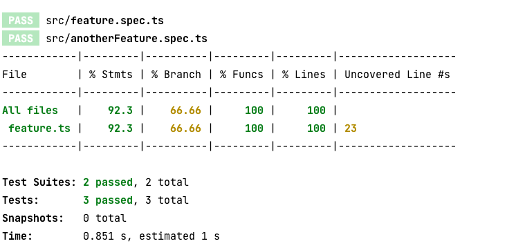

## SWC Comment Dropping workaround example

See https://github.com/swc-project/swc/issues/2964

This repo provides an example for how to work around the dropping of comments.

See the coverage output:

